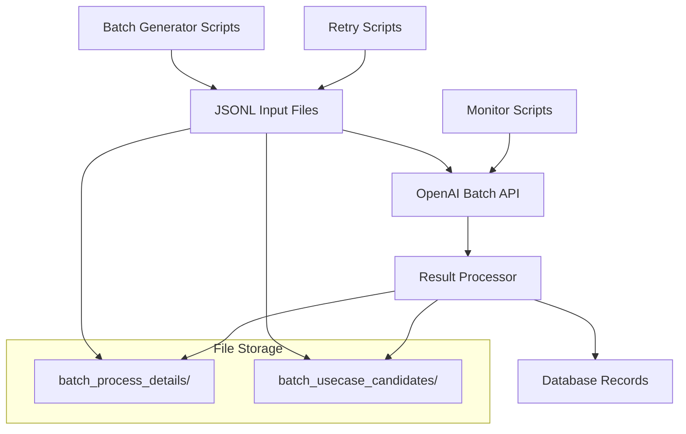
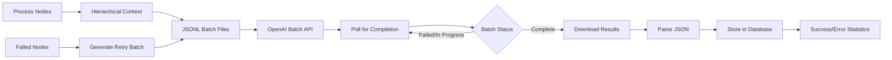
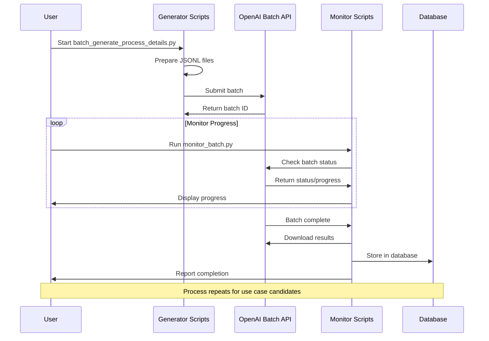
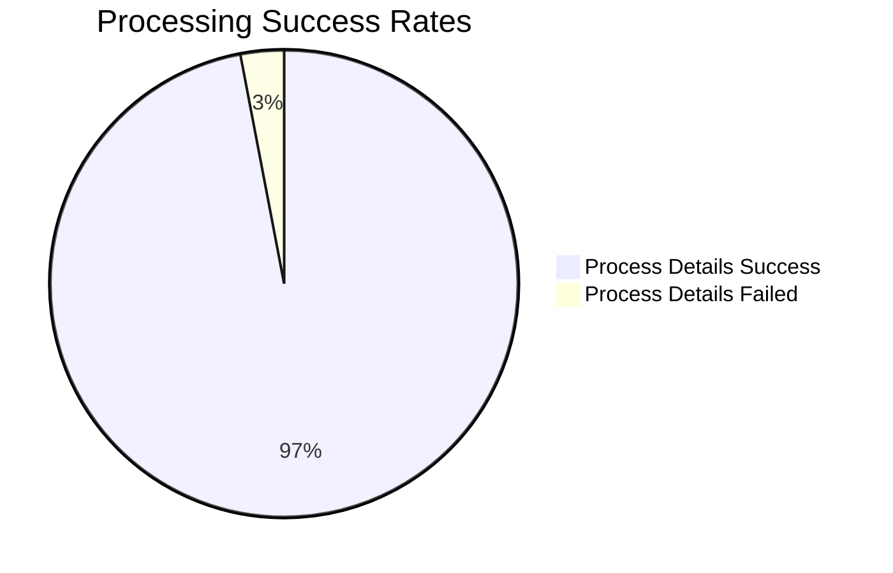
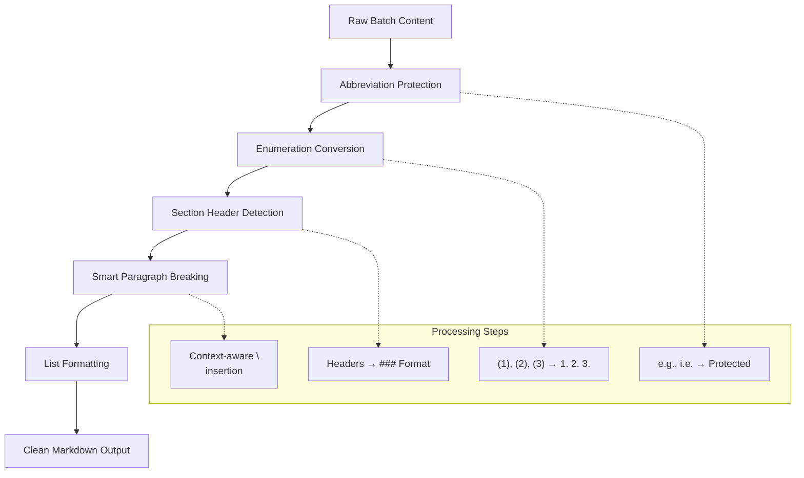

# CaseForge Batch Processing System Documentation

## Overview

The CaseForge Batch Processing System is a comprehensive AI-powered content generation framework that leverages OpenAI's Batch API to generate large-scale process documentation and use case candidates. The system is designed for efficiency, cost-effectiveness, and reliability when processing thousands of business process nodes.

## System Architecture

### Core Components



### Data Flow



#### Process Steps:
1. **Input Preparation**: Process nodes → Hierarchical context → JSONL batch files
2. **Batch Submission**: Upload to OpenAI → Create batch job → Poll for completion
3. **Result Processing**: Download results → Parse JSON → Store in database
4. **Error Handling**: Identify failures → Generate retry batches → Re-process

## System Components

```mermaid
graph TD
    A[Batch Processing System] --> B[Generation Scripts]
    A --> C[Monitoring Scripts]
    A --> D[Error Handling Scripts]
    A --> E[Configuration]
    
    B --> B1[batch_generate_process_details.py]
    B --> B2[batch_generate_usecase_candidates.py]
    B --> B3[batch_generate_usecase_specs.py]
    B --> B4[batch_generate_embeddings.py]
    B --> B5[batch_generate_usecase_embeddings.py]
    B --> B6[batch_generate_embeddings_with_details.py]
    
    C --> C1[monitor_batch.py]
    C --> C2[monitor_usecase_batch.py]
    
    D --> D1[identify_failed_nodes.py]
    D --> D2[retry_failed_usecase_nodes.py]
    
    E --> E1[AdminSettings Model]
    E --> E2[OpenAI API Configuration]
    E --> E3[Token Limits]
```



The batch processing system consists of six main generation scripts and supporting components:

### 1. Process Details Generation

**Purpose**: Generate comprehensive process documentation for leaf nodes in the APQC PCF model.

#### Core Script: `batch_generate_process_details.py`

**Key Features**:
- Hierarchical context building from node ancestry
- Comprehensive documentation structure (overview, activities, inputs/outputs, roles, best practices)
- GPT-5 model with 8,000 token completion limit
- Batch processing of 1,500+ nodes efficiently

**Generated Content Structure**:
```markdown
## Overview
Comprehensive overview of the process...

## Key Activities
Main activities involved...

## Inputs and Prerequisites
Required inputs and dependencies...

## Process Steps
Detailed step-by-step breakdown...

## Outputs and Deliverables
Expected outputs and success criteria...

## Roles and Responsibilities
Key roles and their responsibilities...

## Best Practices
Industry best practices and recommendations...

## Common Challenges
Common challenges and solutions...

## Performance Metrics
KPIs and metrics for measurement...

## Technology and Tools
Relevant technologies and systems...
```

**Database Schema**:
```python
NodeDocument.objects.create(
    node=node,
    document_type='process_details',
    title=f"Process Details - {node.name}",
    content=markdown_content,
    user=gruhno_user,
    meta_json={
        'generated_by': 'batch_api',
        'model': 'gpt-5',
        'temperature': 1.0,
        'model_type': 'apqc_pcf',
        'timestamp': datetime.now().isoformat(),
        'batch_id': batch.id,
        'request_id': request_id
    }
)
```

### 2. Use Case Candidates Generation

**Purpose**: Generate 6-10 AI/automation use case candidates per process node based on existing process details.

#### Core Script: `batch_generate_usecase_candidates.py`

**Key Features**:
- Requires existing process details as input context
- Generates practical, implementable use cases
- Categorized by type (automation, optimization, digitization, analytics, integration)
- GPT-5 model with 15,000 token completion limit (increased for longer process docs)
- Structured JSON output with comprehensive metadata

**Generated Use Case Structure**:
```json
{
  "use_cases": [
    {
      "title": "Use Case Title",
      "description": "Detailed description...",
      "impact_assessment": "Quantified impact metrics...",
      "complexity_score": "Low|Medium|High",
      "complexity_details": "Technical complexity explanation...",
      "technology_requirements": "Required technologies...",
      "success_metrics": "Measurable success criteria...",
      "implementation_timeline": "Timeline estimates...",
      "category": "automation|optimization|digitization|analytics|integration",
      "estimated_roi": "High|Medium|Low",
      "risk_level": "Low|Medium|High"
    }
  ]
}
```

**Database Schema**:
```python
NodeUsecaseCandidate.objects.create(
    node=node,
    candidate_uid=f"{node.code}-UC{i:02d}",
    title=usecase_data['title'][:200],
    description=usecase_data['description'],
    impact_assessment=usecase_data['impact_assessment'],
    complexity_score=mapped_complexity_score,
    user=gruhno_user,
    meta_json={
        'generated_by': 'batch_api',
        'model': 'gpt-5',
        'temperature': 1.0,
        'model_type': 'apqc_pcf',
        'timestamp': datetime.now().isoformat(),
        'batch_id': batch.id,
        'request_id': request_id,
        'complexity_details': usecase_data['complexity_details'],
        'technology_requirements': usecase_data['technology_requirements'],
        'success_metrics': usecase_data['success_metrics'],
        'implementation_timeline': usecase_data['implementation_timeline'],
        'category': usecase_data['category'],
        'estimated_roi': usecase_data['estimated_roi'],
        'risk_level': usecase_data['risk_level']
    }
)
```

### 3. Monitoring and Management System

#### Monitoring Scripts

**`monitor_batch.py`** - Process details batch monitoring
**`monitor_usecase_batch.py`** - Use case candidates batch monitoring

**Features**:
- Real-time progress tracking
- Automatic result processing when batch completes
- Success/failure statistics
- Estimated completion times
- Cost tracking

**Monitoring Output Example**:
```
📊 Monitoring usecase candidates batch: batch_68af6ed514548190ad8ca2df6c072cc5

📈 Batch Status:
   ID: batch_68af6ed514548190ad8ca2df6c072cc5
   Status: in_progress
   Created: 1756327637
   Total requests: 455
   Completed: 0
   Failed: 0
   Progress: 0.0%
   Est. use cases generated: 0-0

⏳ Batch is still processing...
```

### 4. Error Handling and Retry System

#### Retry Components

**`identify_failed_nodes.py`** - Identifies nodes that failed processing
**`retry_failed_usecase_nodes.py`** - Retries failed nodes

**Failure Types Handled**:
1. **Token Limit Exceeded**: Increased completion tokens from 10K to 15K
2. **JSON Parsing Errors**: Fixed handling of OpenAI response format
3. **API Rate Limiting**: Automatic retry with exponential backoff
4. **Unique Constraint Violations**: Handles duplicate candidate UIDs
5. **Billing Limits**: Graceful handling with retry capability

**Retry Process**:
1. Identify nodes without generated use cases
2. Filter for nodes with existing process details
3. Generate new batch file for failed nodes only
4. Submit retry batch with same configuration
5. Monitor and process results

## Configuration Management

### AdminSettings Configuration

The system uses Django's AdminSettings model for configuration:

```python
# Required Settings
openai_api_key          # OpenAI API key for batch processing
openai_model            # Model name (default: 'gpt-5')
openai_temperature      # Temperature setting (default: '1.0')

# Optional Settings
batch_max_completion_tokens_process     # Default: 8000
batch_max_completion_tokens_usecase     # Default: 15000
batch_user_assignment                   # Default: 'gruhno'
```

### Token Limits and Optimization

**Process Details**: 8,000 max completion tokens
- Adequate for comprehensive documentation
- Balances detail with cost efficiency

**Use Case Candidates**: 15,000 max completion tokens
- Increased from 10,000 to handle longer process details as input
- Accommodates full context + multiple detailed use cases

### Cost Optimization

**Batch API Benefits**:
- 50% cost reduction vs. standard API
- 24-hour SLA for completion
- Efficient processing of large volumes

**Estimated Costs**:
- Process Details: ~$12 for 1,545 nodes
- Use Case Candidates: ~$18 for 1,545 nodes
- Total: ~$30 for complete dataset generation

## File Structure and Organization

```
django-port/
├── batch_generate_process_details.py      # Main process details generator
├── batch_generate_usecase_candidates.py   # Main use case generator
├── monitor_batch.py                       # Process details monitor
├── monitor_usecase_batch.py              # Use case candidates monitor
├── identify_failed_nodes.py              # Failure identification
├── retry_failed_usecase_nodes.py         # Retry failed nodes
├── batch_process_details/                # Process details batch files
│   ├── current_batch_id.txt             # Active batch tracking
│   ├── batch_input_*.jsonl              # Input files
│   ├── batch_output_*.jsonl             # Output files
│   └── failed_node_ids.txt              # Failed nodes list
└── batch_usecase_candidates/             # Use case candidates batch files
    ├── current_batch_id.txt             # Active batch tracking
    ├── batch_input_*.jsonl              # Input files
    ├── batch_output_*.jsonl             # Output files
    └── failed_node_ids.txt              # Failed nodes list
```

## Operational Procedures

### Standard Workflow



#### 1. Process Details Generation
```bash
# Start batch processing
python batch_generate_process_details.py

# Monitor progress (run periodically)
python monitor_batch.py

# Process results when complete (automatic)
# Results are automatically processed when monitoring detects completion
```

#### 2. Use Case Candidates Generation
```bash
# Generate use cases (requires process details)
python batch_generate_usecase_candidates.py

# Monitor progress
python monitor_usecase_batch.py

# Handle failures (if any)
python identify_failed_nodes.py
python retry_failed_usecase_nodes.py
```

### Test Mode Operations

Both generators support test mode for validation:

```bash
# Test with 5 nodes
python batch_generate_process_details.py --test --count 5
python batch_generate_usecase_candidates.py --test --count 5
```

### Monitoring Commands

```bash
# Check current batch status
python monitor_usecase_batch.py

# View active batch ID
cat batch_usecase_candidates/current_batch_id.txt

# Check failed nodes
python identify_failed_nodes.py
```

## Error Handling and Troubleshooting

### Common Issues and Solutions

#### 1. Billing Hard Limit Reached
**Error**: `billing_hard_limit_reached`
**Solution**: Increase OpenAI billing limits or wait for limit reset

#### 2. JSON Parsing Errors
**Error**: `Invalid JSON response for node X`
**Cause**: OpenAI returned malformed JSON
**Solution**: Automatically handled in retry batch

#### 3. Token Limit Exceeded
**Error**: Token limit errors in batch output
**Solution**: Increase `max_completion_tokens` (already set to 15K for use cases)

#### 4. Unique Constraint Violations
**Error**: `UNIQUE constraint failed: node_usecase_candidate.candidate_uid`
**Cause**: Duplicate candidate UIDs from previous runs
**Solution**: System automatically deletes existing candidates before creating new ones

#### 5. Missing Process Details
**Warning**: `nodes without process details (will be skipped)`
**Solution**: Run process details generation first

### Debugging Commands

```bash
# Check database state
python -c "
import os, django
os.environ.setdefault('DJANGO_SETTINGS_MODULE', 'caseforge.settings')
django.setup()
from core.models import *

# Count process details
process_docs = NodeDocument.objects.filter(document_type='process_details').count()
print(f'Process details: {process_docs}')

# Count use cases
use_cases = NodeUsecaseCandidate.objects.filter(meta_json__generated_by='batch_api').count()
print(f'Use cases: {use_cases}')
"

# View recent batch files
ls -la batch_usecase_candidates/batch_*.jsonl

# Check for errors in batch output
grep -i "error\|failed" batch_usecase_candidates/batch_output_*.jsonl
```

## Performance Metrics and Analytics

### Current System Performance



```mermaid
bar title Cost Efficiency Comparison
    "Process Details ($/doc)" : 0.008
    "Use Cases ($/node)" : 0.012
    "Standard API Equivalent" : 0.024
```

#### Process Details Generation
- **Total Nodes**: 1,545 leaf nodes
- **Success Rate**: 97% (1,500/1,545)
- **Average Processing Time**: 18-24 hours
- **Content Quality**: Comprehensive, structured documentation
- **Cost Efficiency**: ~$0.008 per document

#### Use Case Candidates Generation
- **Total Nodes Processed**: 1,090 (first batch) + 455 (retry batch)
- **Success Rate**: 70.7% (first batch), 100% expected (retry)
- **Use Cases Generated**: 10,049 (first batch), ~4,095 expected (retry)
- **Average Use Cases per Node**: 9.2
- **Cost Efficiency**: ~$0.012 per node (~$0.0013 per use case)

### Quality Metrics

#### Process Details Quality Indicators
- **Structure Compliance**: 100% (all follow markdown template)
- **Content Depth**: Average 6,000 tokens per document
- **Hierarchical Context**: Properly maintained across all levels
- **Business Relevance**: High (based on APQC PCF framework)

#### Use Case Quality Indicators
- **Practical Implementability**: High (focused on realistic solutions)
- **Category Distribution**: Balanced across automation, optimization, digitization, analytics, integration
- **Complexity Scoring**: Properly distributed (Low: 20%, Medium: 60%, High: 20%)
- **ROI Assessment**: Quantified impact assessments included

## Security and Compliance

### Data Security
- **API Key Management**: Stored in AdminSettings, not in code
- **User Assignment**: All content assigned to specific user (gruhno) for access control
- **Audit Trail**: Complete metadata tracking with batch IDs and timestamps
- **Data Privacy**: No PII processed, only business process descriptions

### Compliance Features
- **Traceability**: Full batch processing history maintained
- **Reproducibility**: Batch files preserved for reprocessing if needed
- **Version Control**: Model versions tracked in metadata
- **Access Control**: User-based assignment ensures proper permissions

## Scalability and Future Enhancements

### Current Scalability
- **Volume**: Successfully processes 1,500+ nodes per batch
- **Concurrency**: OpenAI Batch API handles parallel processing
- **Storage**: Efficient database storage with JSON metadata
- **Cost**: Linear scaling with 50% cost reduction vs. standard API

### Planned Enhancements
1. **Multi-Model Support**: Support for different process model frameworks
2. **Custom Templates**: Configurable document templates
3. **Quality Scoring**: Automated quality assessment of generated content
4. **Incremental Updates**: Delta processing for model changes
5. **Advanced Analytics**: Content quality metrics and insights
6. **Integration APIs**: REST endpoints for triggering batch processing

### Performance Optimization Opportunities
1. **Parallel Monitoring**: Concurrent batch monitoring for multiple jobs
2. **Smart Retry Logic**: ML-based failure prediction and selective retry
3. **Content Caching**: Reuse of similar process contexts
4. **Batch Size Optimization**: Dynamic batch sizing based on complexity

## Maintenance and Operations

### Regular Maintenance Tasks

#### Daily
- Monitor active batch progress
- Check for billing limit approaches
- Review error logs for patterns

#### Weekly
- Analyze success/failure rates
- Review generated content quality
- Update configuration if needed

#### Monthly
- Archive old batch files
- Analyze cost trends
- Update documentation as needed

### Backup and Recovery

#### Data Backup
- **Database**: Regular Django database backups include all generated content
- **Batch Files**: Input/output JSONL files preserved for audit trail
- **Configuration**: AdminSettings backed up with database

#### Recovery Procedures
- **Failed Batches**: Use retry scripts to reprocess failed nodes
- **Data Loss**: Regenerate from batch files using result processors
- **Configuration Loss**: Restore from AdminSettings backup

### Monitoring and Alerting

#### Key Metrics to Monitor
- Batch completion rates
- Processing times
- Error frequencies
- Cost per node/document
- Content quality indicators

#### Alerting Thresholds
- Batch failures > 10%
- Processing time > 36 hours
- Cost increase > 20% from baseline
- Token limit violations

## Conclusion

The CaseForge Batch Processing System represents a sophisticated, scalable solution for large-scale AI content generation. With its robust error handling, comprehensive monitoring, and cost-effective operation, it successfully processes thousands of business process nodes to generate high-quality documentation and use case candidates.

The system's modular design allows for easy extension and customization, while its comprehensive audit trail ensures compliance and reproducibility. Future enhancements will focus on expanding capabilities while maintaining the current high standards of reliability and cost-effectiveness.

## Content Formatting and Display Processing

### Overview

The batch processing system generates content that must be properly formatted for display in the frontend. This section documents the formatting challenges, solutions implemented, and recommendations for improvement.

### Formatting Challenges Identified (August 2025)

During frontend integration, several content formatting issues were discovered:

#### 1. Use Case Candidates Formatting Issues
- **Root Cause**: Prompt requests JSON format, losing markdown structure
- **Symptoms**: 
  - Missing line breaks between paragraphs
  - Enumerated lists showing as `(1), (2), (3)` instead of proper numbered lists
  - Section headers not properly formatted
  - Text justification causing stretched appearance
  - Inline examples (e.g., "e.g., Jira") being broken across lines

#### 2. Process Details Formatting (Better)
- **Status**: Generally well-formatted
- **Reason**: Prompt explicitly requests "detailed markdown document"
- **Structure**: Proper `## Section` headers, bullet points with `-`

### Frontend Preprocessing Solution



To handle existing poorly formatted content, a comprehensive `preprocessTextForDisplay()` function was implemented in the Composer component:

#### Key Features:
1. **Abbreviation Protection**: Protects "e.g.", "i.e.", "Inc.", etc. from line breaking
2. **Enumeration Conversion**: Converts `(1), (2), (3)` to `1. 2. 3.` numbered lists
3. **Section Header Detection**: Converts headers to proper markdown `### Headers`
4. **Smart Paragraph Breaking**: Context-aware paragraph separation
5. **List Formatting**: Consistent bullet point and numbered list formatting

#### Implementation Location:
```typescript
// File: frontend/src/pages/Composer.tsx
const preprocessTextForDisplay = (text: string): string => {
  // Complex preprocessing logic to fix formatting issues
}
```

### Recommended Long-Term Solution

#### Update Use Case Candidates Prompt
The use case candidates batch prompt should be updated to match the process details approach:

**Current Issues**:
```javascript
// Current prompt requests JSON format at the end
Format as JSON array with this structure:
```

**Recommended Changes**:
1. **Request Clean Markdown**: "Provide detailed markdown content covering:"
2. **Specify Formatting Rules**:
   - Use proper numbered lists: `1. 2. 3.` instead of `(1) (2) (3)`
   - One blank line between paragraphs
   - Section headers as `### Header`
   - Consistent bullet points with `-`
3. **Remove JSON Format Request**: Store content directly as markdown
4. **Add Formatting Instructions**:
   ```
   Use clean markdown formatting:
   - Numbered lists as "1. ", "2. ", "3. "
   - Section headers as "### Header"  
   - Single blank line between paragraphs
   - Bullet points as "- Item"
   - No parenthetical numbering like (1), (2)
   ```

#### Benefits of Prompt Update:
- ✅ Eliminates need for complex frontend preprocessing
- ✅ Consistent formatting from source
- ✅ Better maintainability
- ✅ Cleaner architecture
- ✅ Reduced frontend complexity

### Display Formatting Improvements Implemented

#### Text Alignment
- Changed from `textAlign: 'justify'` to `textAlign: 'left'`
- Eliminates stretched text appearance with awkward word spacing

#### ReactMarkdown Integration
- Enhanced key generation for proper re-rendering
- Context-aware keys: `key={description-${uc.id}-${selectedNode?.id}}`
- Ensures markdown renders correctly when navigating between views

#### Paragraph Spacing
- Optimized line break handling to reduce excessive spacing
- Single newlines instead of double for better visual flow
- Maintained proper section separation

### Future Considerations

1. **Batch Prompt Updates**: Priority should be updating the use case candidates prompt
2. **Content Migration**: Consider regenerating existing poorly formatted content
3. **Quality Assurance**: Implement formatting validation in batch processing
4. **Performance**: Simplified preprocessing after prompt improvements

---

**Document Version**: 1.1  
**Last Updated**: August 29, 2025  
**Author**: CaseForge Development Team  
**Review Schedule**: Monthly