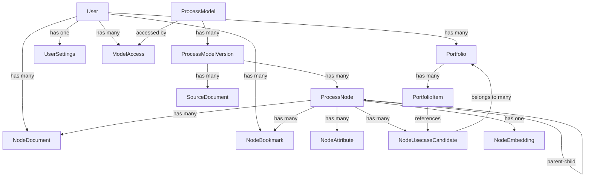

# CaseForge Django Project - Technical Documentation

## Project Overview

CaseForge is a Django-based business process management and use case analysis system. It allows organizations to model business processes, document use cases, and manage portfolios of process improvements.

## Starting the Server

To start the CaseForge Django development server:

```bash
cd django-port
./start.sh
```

Or manually:
```bash
cd django-port
source venv/bin/activate
python manage.py runserver
```

**Important**: Always use the project's virtual environment (`venv`) - do NOT use system Python.

## Project Structure

```
django-port/
├── caseforge/          # Main Django settings module
│   ├── settings.py     # Django settings
│   ├── urls.py         # Root URL configuration
│   ├── celery.py       # Celery configuration
│   └── wsgi.py         # WSGI application
├── core/               # Core business models and admin
│   ├── models.py       # Data models
│   ├── admin.py        # Django admin configuration
│   └── monitoring.py   # System monitoring (requires psutil)
├── api/                # REST API application
│   ├── views.py        # API views and viewsets
│   ├── serializers.py  # DRF serializers
│   └── urls.py         # API URL routing
├── frontend/           # React frontend application
├── manage.py           # Django management script
├── requirements.txt    # Python dependencies
└── venv/              # Python virtual environment
```

## Technology Stack

- **Backend**: Django 4.2+
- **API**: Django REST Framework
- **Database**: SQLite (development), PostgreSQL ready
- **Task Queue**: Celery (configured)
- **Frontend**: React with TypeScript
- **Authentication**: JWT tokens (PyJWT)
- **CORS**: django-corsheaders

## Data Model

### Core Entities

#### User (extends Django AbstractUser)
- Custom user model with additional fields
- Relationships: documents, bookmarks, portfolios, settings

#### ProcessModel
- Represents a business process model
- Fields: model_key (unique), name, description
- Relationships: Has multiple versions

#### ProcessModelVersion
- Version of a process model
- Fields: version_label, external_reference, notes, effective_date, is_current
- Relationships: Belongs to ProcessModel, has nodes and documents

#### ProcessNode
- Hierarchical process node/activity
- Fields: code, name, description, level, display_order, materialized_path
- Self-referential parent-child relationship
- Relationships: Has attributes, documents, embeddings, use cases

#### NodeDocument
- Documentation for process nodes
- Types: process_details, usecase_spec, research_summary
- Fields: document_type, title, content, meta_json
- Relationships: Belongs to node and user

#### NodeUsecaseCandidate
- Potential use case/improvement for a process node
- Fields: candidate_uid, title, description, impact_assessment, complexity_score
- Relationships: Can be added to portfolios

#### NodeEmbedding
- AI embeddings for semantic search
- Fields: embedding_vector (JSON), embedding_model
- One-to-one with ProcessNode

#### Portfolio
- Collection of use cases
- Fields: name, description
- Relationships: Contains multiple use case candidates via PortfolioItem

#### NodeBookmark
- User bookmarks for quick access to nodes
- Unique constraint: one bookmark per user-node pair

#### UserSettings
- User preferences and configuration
- Fields: preferred_model, theme, settings_json

#### ModelAccess
- Access control for process models
- Links users to models they can access

#### AdminSettings
- System-wide configuration settings
- Key-value store with helper methods

### Relationships



## API Endpoints

### Authentication
- `POST /api/auth/signup/` - User registration
- `POST /api/auth/token/` - JWT token generation
- `GET /api/auth/me/` - Current user info

### Dashboard
- `GET /api/dashboard/specs/` - Dashboard specifications

### User Settings
- `GET /api/settings/` - Get user settings
- `POST /api/settings/update/` - Update user settings

### REST ViewSets (CRUD operations)
- `/api/models/` - ProcessModel management
- `/api/versions/` - ProcessModelVersion management
- `/api/nodes/` - ProcessNode operations (includes tree structure)
- `/api/documents/` - NodeDocument management
- `/api/usecases/` - NodeUsecaseCandidate operations
- `/api/bookmarks/` - NodeBookmark management
- `/api/portfolios/` - Portfolio and PortfolioItem operations

### Special ViewSet Actions
- `GET /api/nodes/{id}/tree/` - Get hierarchical tree structure
- `GET /api/nodes/{id}/children/` - Get direct children
- `GET /api/nodes/{id}/ancestors/` - Get ancestor path
- `GET /api/nodes/{id}/siblings/` - Get sibling nodes
- `POST /api/nodes/{id}/search/` - Search within subtree
- Various portfolio item management endpoints

## Authentication Flow

1. User registers via `/api/auth/signup/`
2. User logs in via `/api/auth/token/` with email/username and password
3. Server returns JWT token
4. Client includes token in `Authorization: Bearer <token>` header
5. JWT expires after configured time (settings.JWT_EXPIRATION_DELTA)

## Key Features

- **Hierarchical Process Modeling**: Multi-level process nodes with parent-child relationships
- **Version Control**: Track multiple versions of process models
- **Document Management**: Attach various document types to process nodes
- **Use Case Analysis**: Identify and track improvement opportunities
- **Portfolio Management**: Organize use cases into portfolios
- **AI Integration**: Node embeddings for semantic search
- **Multi-tenancy**: User-based access control to models
- **Bookmarking**: Quick access to frequently used nodes
- **Admin Dashboard**: System monitoring and configuration

## Configuration

Key settings in `caseforge/settings.py`:
- `DEBUG`: Development/production mode
- `ALLOWED_HOSTS`: Permitted host headers
- `CORS_ALLOWED_ORIGINS`: Frontend URLs for CORS
- `JWT_SECRET_KEY`: Secret for JWT signing
- `JWT_EXPIRATION_DELTA`: Token expiration time
- Database configuration (SQLite default)

## Frontend Integration

The React frontend in `frontend/` communicates with the Django API:
- Uses JWT authentication
- Implements responsive UI for process navigation
- Provides forms for document and use case creation
- Manages user portfolios and bookmarks

## Development Notes

- The monitoring module requires `psutil` package
- Celery is configured but not required for basic operation
- Uses Django admin for backend management
- Includes custom admin theme and dashboard
- Frontend build files are served by Django in production

## Database Schema

All models use explicit table names (e.g., `db_table = 'process_model'`) for database portability. Key indexes are defined for performance optimization on frequently queried fields.

## Security Considerations

- JWT tokens for stateless authentication
- CSRF protection enabled
- CORS configured for specific origins
- User-based access control to process models
- Secure password hashing via Django's auth system

## Common Tasks

### Create superuser
```bash
python manage.py createsuperuser
```

### Run migrations
```bash
python manage.py makemigrations
python manage.py migrate
```

### Access Django admin
Navigate to: http://localhost:8000/admin/

### Run tests
```bash
python manage.py test
```

### Collect static files (production)
```bash
python manage.py collectstatic
```

## Node Embeddings System

### How Embeddings Are Created

The system uses OpenAI's `text-embedding-3-small` model to create embeddings for process nodes, enabling semantic search functionality.

#### Embedding Generation Process:

1. **Celery Task**: `generate_embeddings_task` in `api/tasks.py:297`
   - Accepts a list of node IDs
   - Creates text representation: `"{node.name}. {node.description}"`
   - Calls OpenAI API to generate embeddings
   - Stores results in `NodeEmbedding` model

2. **OpenAI Service**: `api/services.py:199-230`
   - Uses `AsyncOpenAI` client
   - Model: `text-embedding-3-small`
   - Returns 1536-dimensional vectors
   - Stored as JSON in database

3. **Storage**: `NodeEmbedding` model
   - One-to-one relationship with `ProcessNode`
   - Fields: `embedding_vector` (JSON), `embedding_model`, `created_at`

#### When Embeddings Are Created:

- **Manual trigger**: Via Celery task `generate_embeddings_task`
- **Not automatic**: Embeddings must be explicitly generated
- **Bulk processing**: Can process multiple nodes at once

#### Using Embeddings for Search:

The `ContextService._find_similar_nodes()` method (currently placeholder) is designed to:
- Calculate cosine similarity between query embedding and node embeddings
- Return nodes ranked by similarity score
- Support cross-category search when enabled

#### Important Notes:

- **OpenAI API Key Required**: Set via Admin Settings or environment variable
- **Async Processing**: Uses Celery for background processing
- **Embedding Model**: Fixed to `text-embedding-3-small` for consistency
- **Text Format**: Combines node name and description for context

## Batch Processing System

CaseForge includes a comprehensive batch processing system for generating AI content at scale using OpenAI's Batch API. This system can process thousands of nodes efficiently and cost-effectively.

### Available Batch Scripts

#### 1. Process Details Generation
**Script**: `batch_generate_process_details.py`
**Purpose**: Generates comprehensive process documentation for all leaf nodes

```bash
# Generate process details for all leaf nodes
python batch_generate_process_details.py

# Test mode (5 nodes)
python batch_generate_process_details.py --test --count 5
```

**Features**:
- Hierarchical context building for each process node
- Comprehensive documentation including overview, steps, inputs/outputs, roles, best practices
- Uses GPT-5 model with 8,000 token completion limit
- Assigns documents to gruhno user for UI visibility
- Full audit trail with batch metadata

#### 2. Use Case Candidates Generation
**Script**: `batch_generate_usecase_candidates.py`
**Purpose**: Generates 6-10 AI/automation use cases per process node

```bash
# Generate use cases for all nodes with process details
python batch_generate_usecase_candidates.py

# Test mode (5 nodes)
python batch_generate_usecase_candidates.py --test --count 5
```

**Features**:
- Requires existing process details documents as input
- Generates practical, implementable use case candidates
- Categories: automation, optimization, digitization, analytics, integration
- Uses GPT-5 model with 15,000 token completion limit
- Assigns to gruhno user for UI visibility
- Structured output with impact assessment, complexity scoring, ROI estimates

#### 3. Batch Monitoring and Management
**Scripts**: `monitor_batch.py`, `monitor_usecase_batch.py`
**Purpose**: Monitor batch progress and process results

```bash
# Monitor process details batch
python monitor_batch.py

# Monitor use case candidates batch
python monitor_usecase_batch.py
```

**Features**:
- Real-time progress tracking
- Automatic result processing when batch completes
- Error handling and reporting
- Success/failure statistics

#### 4. Retry Failed Nodes
**Scripts**: `identify_failed_nodes.py`, `retry_failed_usecase_nodes.py`
**Purpose**: Retry processing for nodes that failed in initial batch

```bash
# Identify nodes that failed processing
python identify_failed_nodes.py

# Retry failed nodes
python retry_failed_usecase_nodes.py
```

### Batch Processing Workflow

1. **Process Details Generation**:
   ```bash
   python batch_generate_process_details.py
   python monitor_batch.py  # Wait for completion
   ```

2. **Use Case Candidates Generation**:
   ```bash
   python batch_generate_usecase_candidates.py
   python monitor_usecase_batch.py  # Wait for completion
   ```

3. **Handle Failures** (if any):
   ```bash
   python identify_failed_nodes.py
   python retry_failed_usecase_nodes.py
   ```

### Batch Configuration

**Key Settings** (configured via AdminSettings):
- `openai_api_key`: OpenAI API key for batch processing
- `openai_model`: Model to use (default: gpt-5)
- `openai_temperature`: Temperature setting (default: 1.0)

**Token Limits**:
- Process details: 8,000 max completion tokens
- Use case candidates: 15,000 max completion tokens (increased to handle longer process docs)

**User Assignment**: All generated content is assigned to the `gruhno` user to ensure UI visibility.

### Batch Processing Results

**Process Details** (as of latest run):
- Total leaf nodes: 1,545
- Successfully processed: 1,500 (97% success rate)
- Documents created: 1,500 comprehensive process documents
- Average document length: ~6,000 tokens

**Use Case Candidates** (as of latest run):
- Successfully processed: 1,090/1,545 nodes (70.7%)
- Use cases created: 10,049 total
- Retry batch: 455 nodes in progress
- Expected final total: ~13,500 use cases

### Monitoring Batch Status

Batches typically complete within 24 hours. Monitor using:

```bash
# Check current batch status
python monitor_usecase_batch.py

# View batch ID
cat batch_usecase_candidates/current_batch_id.txt
```

**Batch File Locations**:
- Process details: `batch_process_details/`
- Use case candidates: `batch_usecase_candidates/`
- Input files: `batch_input_*.jsonl`
- Output files: `batch_output_*.jsonl`

## Environment Variables

Create `.env` file from `.env.example`:
- `SECRET_KEY`: Django secret key
- `DEBUG`: Debug mode (True/False)
- `ALLOWED_HOSTS`: Comma-separated list of hosts
- `DATABASE_URL`: Database connection string (optional)
- `JWT_SECRET_KEY`: JWT signing key
- `JWT_EXPIRATION_DELTA`: Token expiration in minutes
- `OPENAI_API_KEY`: OpenAI API key for embeddings and AI generation
- `OPENAI_MODEL`: OpenAI model for text generation (default: gpt-5)
- `OPENAI_TEMPERATURE`: Temperature for AI generation (default: 1.0)