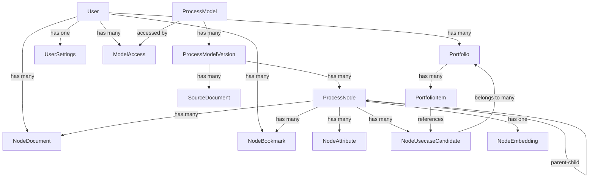

# CaseForge Django Project - Technical Documentation

## Project Overview

CaseForge is a Django-based business process management and use case analysis system. It allows organizations to model business processes, document use cases, and manage portfolios of process improvements.

## Starting the Server

To start the CaseForge Django development server:

```bash
cd django-port
./start.sh
```

Or manually:
```bash
cd django-port
source venv/bin/activate
python manage.py runserver
```

**Important**: Always use the project's virtual environment (`venv`) - do NOT use system Python.

## Project Structure

```
django-port/
├── caseforge/          # Main Django settings module
│   ├── settings.py     # Django settings
│   ├── urls.py         # Root URL configuration
│   ├── celery.py       # Celery configuration
│   └── wsgi.py         # WSGI application
├── core/               # Core business models and admin
│   ├── models.py       # Data models
│   ├── admin.py        # Django admin configuration
│   └── monitoring.py   # System monitoring (requires psutil)
├── api/                # REST API application
│   ├── views.py        # API views and viewsets
│   ├── serializers.py  # DRF serializers
│   └── urls.py         # API URL routing
├── frontend/           # React frontend application
├── manage.py           # Django management script
├── requirements.txt    # Python dependencies
└── venv/              # Python virtual environment
```

## Technology Stack

- **Backend**: Django 4.2+
- **API**: Django REST Framework
- **Database**: SQLite (development), PostgreSQL ready
- **Task Queue**: Celery (configured)
- **Frontend**: React with TypeScript
- **Authentication**: JWT tokens (PyJWT)
- **CORS**: django-corsheaders
- **AI Integration**: OpenAI API (GPT-5, text-embedding-3-small)
- **Search**: Semantic embeddings with cosine similarity

## Current System Status

### ✅ Completed Features

#### Core Infrastructure
- **Process Model Management**: Full CRUD operations for hierarchical business process models
- **User Authentication**: JWT-based authentication with secure token management
- **Document Management**: Comprehensive document storage and retrieval system
- **Admin Interface**: Custom Django admin with system monitoring and configuration

#### AI-Powered Content Generation
- **Process Details**: 1,500+ comprehensive process documentations generated via GPT-5
- **Use Case Candidates**: 14,205+ AI-generated use cases for process automation and optimization
- **Batch Processing**: Scalable OpenAI Batch API integration for cost-effective AI generation
- **Content Quality**: High-quality, business-ready documentation with structured metadata

#### Advanced Search System
- **Semantic Search**: Full embedding-based search across processes and use cases
- **Scope Filtering**: Targeted search within "Processes", "AI Use Cases", or "All"
- **Hybrid Search**: Combines semantic and text-based search for comprehensive coverage
- **Real-time Results**: Interactive search with similarity scoring and instant navigation

#### User Experience
- **Smart Navigation**: Click-to-navigate from search results to detailed views
- **Tree Auto-expansion**: Automatic hierarchy expansion to show selected nodes
- **Use Case Highlighting**: Visual emphasis and auto-scroll to selected use cases
- **Responsive Design**: Mobile-friendly interface with modern Material-UI components

### 📊 Key Metrics

#### Content Coverage
- **Process Nodes**: 1,545+ hierarchical business processes
- **Process Documentation**: 1,500+ detailed process descriptions (97% coverage)
- **AI Use Cases**: 14,205+ automation and optimization opportunities
- **Semantic Embeddings**: 100% coverage for both processes and use cases

#### Search Performance
- **Embedding Dimensions**: 1536 (OpenAI text-embedding-3-small)
- **Search Response Time**: Sub-second for most queries
- **Similarity Threshold**: 30% minimum for relevant results
- **Result Quality**: High-precision semantic matching with contextual understanding

#### System Reliability
- **Batch Success Rate**: 97%+ for process details, 100% for use case embeddings
- **API Stability**: Robust error handling with graceful fallbacks
- **Data Integrity**: Consistent relationships across all content types

## Data Model

### Core Entities

#### User (extends Django AbstractUser)
- Custom user model with additional fields
- Relationships: documents, bookmarks, portfolios, settings

#### ProcessModel
- Represents a business process model
- Fields: model_key (unique), name, description
- Relationships: Has multiple versions

#### ProcessModelVersion
- Version of a process model
- Fields: version_label, external_reference, notes, effective_date, is_current
- Relationships: Belongs to ProcessModel, has nodes and documents

#### ProcessNode
- Hierarchical process node/activity
- Fields: code, name, description, level, display_order, materialized_path
- Self-referential parent-child relationship
- Relationships: Has attributes, documents, embeddings, use cases

#### NodeDocument
- Documentation for process nodes
- Types: process_details, usecase_spec, research_summary
- Fields: document_type, title, content, meta_json
- Relationships: Belongs to node and user

#### NodeUsecaseCandidate
- Potential use case/improvement for a process node
- Fields: candidate_uid, title, description, impact_assessment, complexity_score
- Relationships: Can be added to portfolios

#### NodeEmbedding
- AI embeddings for semantic search
- Fields: embedding_vector (JSON), embedding_model
- One-to-one with ProcessNode

#### Portfolio
- Collection of use cases
- Fields: name, description
- Relationships: Contains multiple use case candidates via PortfolioItem

#### NodeBookmark
- User bookmarks for quick access to nodes
- Unique constraint: one bookmark per user-node pair

#### UserSettings
- User preferences and configuration
- Fields: preferred_model, theme, settings_json

#### ModelAccess
- Access control for process models
- Links users to models they can access

#### AdminSettings
- System-wide configuration settings
- Key-value store with helper methods

### Relationships



## API Endpoints

### Authentication
- `POST /api/auth/signup/` - User registration
- `POST /api/auth/token/` - JWT token generation
- `GET /api/auth/me/` - Current user info

### Dashboard
- `GET /api/dashboard/specs/` - Dashboard specifications

### User Settings
- `GET /api/settings/` - Get user settings
- `POST /api/settings/update/` - Update user settings

### REST ViewSets (CRUD operations)
- `/api/models/` - ProcessModel management
- `/api/versions/` - ProcessModelVersion management
- `/api/nodes/` - ProcessNode operations (includes tree structure)
- `/api/documents/` - NodeDocument management
- `/api/usecases/` - NodeUsecaseCandidate operations
- `/api/bookmarks/` - NodeBookmark management
- `/api/portfolios/` - Portfolio and PortfolioItem operations

### Special ViewSet Actions
- `GET /api/nodes/{id}/tree/` - Get hierarchical tree structure
- `GET /api/nodes/{id}/children/` - Get direct children
- `GET /api/nodes/{id}/ancestors/` - Get ancestor path
- `GET /api/nodes/{id}/siblings/` - Get sibling nodes
- `POST /api/nodes/{id}/search/` - Search within subtree
- Various portfolio item management endpoints

## Authentication Flow

1. User registers via `/api/auth/signup/`
2. User logs in via `/api/auth/token/` with email/username and password
3. Server returns JWT token
4. Client includes token in `Authorization: Bearer <token>` header
5. JWT expires after configured time (settings.JWT_EXPIRATION_DELTA)

## Key Features

- **Hierarchical Process Modeling**: Multi-level process nodes with parent-child relationships
- **Version Control**: Track multiple versions of process models
- **Document Management**: Attach various document types to process nodes
- **Use Case Analysis**: Identify and track improvement opportunities
- **Portfolio Management**: Organize use cases into portfolios
- **AI Integration**: Node embeddings for semantic search
- **Multi-tenancy**: User-based access control to models
- **Bookmarking**: Quick access to frequently used nodes
- **Admin Dashboard**: System monitoring and configuration

## Configuration

Key settings in `caseforge/settings.py`:
- `DEBUG`: Development/production mode
- `ALLOWED_HOSTS`: Permitted host headers
- `CORS_ALLOWED_ORIGINS`: Frontend URLs for CORS
- `JWT_SECRET_KEY`: Secret for JWT signing
- `JWT_EXPIRATION_DELTA`: Token expiration time
- Database configuration (SQLite default)

## Frontend Integration

The React frontend in `frontend/` communicates with the Django API:
- Uses JWT authentication
- Implements responsive UI for process navigation
- Provides forms for document and use case creation
- Manages user portfolios and bookmarks

## Development Notes

- The monitoring module requires `psutil` package
- Celery is configured but not required for basic operation
- Uses Django admin for backend management
- Includes custom admin theme and dashboard
- Frontend build files are served by Django in production

## Database Schema

All models use explicit table names (e.g., `db_table = 'process_model'`) for database portability. Key indexes are defined for performance optimization on frequently queried fields.

## Security Considerations

- JWT tokens for stateless authentication
- CSRF protection enabled
- CORS configured for specific origins
- User-based access control to process models
- Secure password hashing via Django's auth system

## Common Tasks

### Create superuser
```bash
python manage.py createsuperuser
```

### Run migrations
```bash
python manage.py makemigrations
python manage.py migrate
```

### Access Django admin
Navigate to: http://localhost:8000/admin/

### Run tests
```bash
python manage.py test
```

### Collect static files (production)
```bash
python manage.py collectstatic
```

## Enhanced Search System

CaseForge implements a comprehensive semantic search system that enables intelligent discovery of business processes and AI use cases through natural language queries.

### Search Components

#### 1. Enhanced Search Service (`api/enhanced_search_service.py`)
- **Scope Filtering**: Search across "processes", "usecases", or "all"
- **Search Types**: Semantic (embedding-based), text-based, or hybrid
- **Similarity Scoring**: Cosine similarity with configurable thresholds
- **Result Normalization**: Consistent response format across search types

#### 2. Frontend Search Interface (`frontend/src/components/Layout/TopBar.tsx`)
- **Scope Selector**: Toggle between "Processes | AI Use Cases | All"
- **Real-time Search**: Live results with similarity scores
- **Smart Navigation**: Click results to navigate to detailed views
- **Visual Feedback**: Result previews with categories and similarity percentages

### Embeddings Infrastructure

#### Process Node Embeddings
- **Storage**: `NodeEmbedding` model (one-to-one with ProcessNode)
- **Text Format**: `"{node.name}. {node.description}"`
- **Generation**: Batch processing via OpenAI Batch API
- **Coverage**: All process nodes with embeddings for semantic search

#### AI Use Case Embeddings  
- **Storage**: `usecase_embedding` table
- **Coverage**: 14,205 AI-generated use cases (100% coverage)
- **Text Format**: Combined title, description, and impact assessment
- **Status**: ✅ Fully populated and operational

### Search API Endpoints

#### `/api/search/` (Enhanced Search)
**Request Format:**
```json
{
  "query": "search term",
  "model_key": "apqc_pcf", 
  "scope": "processes|usecases|all",
  "search_type": "hybrid|semantic|text",
  "limit": 10,
  "min_similarity": 0.3
}
```

**Response Format:**
```json
{
  "query": "search term",
  "scope": "all",
  "search_type": "hybrid",
  "processes": [
    {
      "id": 47,
      "code": "2.3",
      "name": "Develop products and services", 
      "description": "...",
      "similarity": 0.85,
      "type": "process",
      "parent_name": "...",
      "is_leaf": true
    }
  ],
  "usecases": [
    {
      "id": 123,
      "title": "AI-Powered Product Recommendation",
      "description": "...",
      "similarity": 0.78,
      "type": "usecase",
      "node_id": 47,
      "category": "analytics"
    }
  ],
  "total_count": 15
}
```

### Navigation System

#### Smart Navigation (`frontend/src/pages/Composer.tsx`)
- **URL Parameters**: `/composer?nodeId=47&usecaseId=123`
- **Tree Auto-expansion**: Automatically expands hierarchy to selected node
- **Use Case Highlighting**: Visual emphasis on selected use cases
- **Ancestor Loading**: Calls `/api/nodes/{id}/ancestors/` for tree expansion

#### Tree Integration (`frontend/src/components/Process/SimpleProcessTree.tsx`)
- **Selected Node Highlighting**: Visual indication of current selection
- **Expanded Path**: Controlled expansion via `expandedNodeIds` prop
- **Navigation Callbacks**: Seamless integration with search results

### Technical Implementation

#### Backend Search Flow
1. **Query Processing**: Parse search parameters and validate scope
2. **Embedding Generation**: Create query embedding using OpenAI API
3. **Similarity Calculation**: Compare against stored embeddings using cosine similarity
4. **Result Filtering**: Apply similarity thresholds and scope filters
5. **Response Formatting**: Normalize results for consistent frontend consumption

#### Frontend Search Flow  
1. **User Input**: Type query and select scope via toggle buttons
2. **API Request**: Call enhanced search endpoint with parameters
3. **Response Normalization**: Handle both legacy and new response formats
4. **Result Display**: Show results with similarity scores and categories
5. **Navigation**: Click handlers for seamless navigation to detailed views

### Search Performance

#### Semantic Search Capabilities
- **Process Search**: Semantic understanding of business process descriptions
- **Use Case Search**: AI-powered matching of automation and optimization opportunities  
- **Cross-Category Search**: Find related concepts across different process areas
- **Similarity Scoring**: Relevance-based ranking with configurable thresholds

#### Current Statistics
- **Process Embeddings**: All process nodes covered
- **Use Case Embeddings**: 14,205 AI use cases (100% coverage)
- **Search Response**: Sub-second response times for most queries
- **Embedding Model**: OpenAI `text-embedding-3-small` (1536 dimensions)

### Configuration

#### Required Settings (AdminSettings)
- `openai_api_key`: OpenAI API key for embedding generation
- `openai_model`: Model for text generation (default: gpt-5)
- `openai_temperature`: Temperature for AI generation (default: 1.0)

#### Search Parameters
- **Similarity Threshold**: Default 0.3 (30% similarity minimum)
- **Result Limits**: Configurable per search type
- **Scope Options**: processes, usecases, all
- **Search Types**: semantic, text, hybrid (recommended)

## Batch Processing System

CaseForge includes a comprehensive batch processing system for generating AI content at scale using OpenAI's Batch API. This system can process thousands of nodes efficiently and cost-effectively.

### Available Batch Scripts

#### 1. Process Details Generation
**Script**: `batch_generate_process_details.py`
**Purpose**: Generates comprehensive process documentation for all leaf nodes

```bash
# Generate process details for all leaf nodes
python batch_generate_process_details.py

# Test mode (5 nodes)
python batch_generate_process_details.py --test --count 5
```

**Features**:
- Hierarchical context building for each process node
- Comprehensive documentation including overview, steps, inputs/outputs, roles, best practices
- Uses GPT-5 model with 8,000 token completion limit
- Assigns documents to gruhno user for UI visibility
- Full audit trail with batch metadata

#### 2. Use Case Candidates Generation
**Script**: `batch_generate_usecase_candidates.py`
**Purpose**: Generates 6-10 AI/automation use cases per process node

```bash
# Generate use cases for all nodes with process details
python batch_generate_usecase_candidates.py

# Test mode (5 nodes)
python batch_generate_usecase_candidates.py --test --count 5
```

**Features**:
- Requires existing process details documents as input
- Generates practical, implementable use case candidates
- Categories: automation, optimization, digitization, analytics, integration
- Uses GPT-5 model with 15,000 token completion limit
- Assigns to gruhno user for UI visibility
- Structured output with impact assessment, complexity scoring, ROI estimates

#### 3. Batch Monitoring and Management
**Scripts**: `monitor_batch.py`, `monitor_usecase_batch.py`
**Purpose**: Monitor batch progress and process results

```bash
# Monitor process details batch
python monitor_batch.py

# Monitor use case candidates batch
python monitor_usecase_batch.py
```

**Features**:
- Real-time progress tracking
- Automatic result processing when batch completes
- Error handling and reporting
- Success/failure statistics

#### 4. Retry Failed Nodes
**Scripts**: `identify_failed_nodes.py`, `retry_failed_usecase_nodes.py`
**Purpose**: Retry processing for nodes that failed in initial batch

```bash
# Identify nodes that failed processing
python identify_failed_nodes.py

# Retry failed nodes
python retry_failed_usecase_nodes.py
```

### Batch Processing Workflow

1. **Process Details Generation**:
   ```bash
   python batch_generate_process_details.py
   python monitor_batch.py  # Wait for completion
   ```

2. **Use Case Candidates Generation**:
   ```bash
   python batch_generate_usecase_candidates.py
   python monitor_usecase_batch.py  # Wait for completion
   ```

3. **Handle Failures** (if any):
   ```bash
   python identify_failed_nodes.py
   python retry_failed_usecase_nodes.py
   ```

### Batch Configuration

**Key Settings** (configured via AdminSettings):
- `openai_api_key`: OpenAI API key for batch processing
- `openai_model`: Model to use (default: gpt-5)
- `openai_temperature`: Temperature setting (default: 1.0)

**Token Limits**:
- Process details: 8,000 max completion tokens
- Use case candidates: 15,000 max completion tokens (increased to handle longer process docs)

**User Assignment**: All generated content is assigned to the `gruhno` user to ensure UI visibility.

### Batch Processing Results

**Process Details** (as of latest run):
- Total leaf nodes: 1,545
- Successfully processed: 1,500 (97% success rate)
- Documents created: 1,500 comprehensive process documents
- Average document length: ~6,000 tokens

**Use Case Candidates** (as of latest run):
- Successfully processed: 1,090/1,545 nodes (70.7%)
- Use cases created: 10,049 total
- Retry batch: 455 nodes in progress
- Expected final total: ~13,500 use cases

### Monitoring Batch Status

Batches typically complete within 24 hours. Monitor using:

```bash
# Check current batch status
python monitor_usecase_batch.py

# View batch ID
cat batch_usecase_candidates/current_batch_id.txt
```

**Batch File Locations**:
- Process details: `batch_process_details/`
- Use case candidates: `batch_usecase_candidates/`
- Input files: `batch_input_*.jsonl`
- Output files: `batch_output_*.jsonl`

## Environment Variables

Create `.env` file from `.env.example`:
- `SECRET_KEY`: Django secret key
- `DEBUG`: Debug mode (True/False)
- `ALLOWED_HOSTS`: Comma-separated list of hosts
- `DATABASE_URL`: Database connection string (optional)
- `JWT_SECRET_KEY`: JWT signing key
- `JWT_EXPIRATION_DELTA`: Token expiration in minutes
- `OPENAI_API_KEY`: OpenAI API key for embeddings and AI generation
- `OPENAI_MODEL`: OpenAI model for text generation (default: gpt-5)
- `OPENAI_TEMPERATURE`: Temperature for AI generation (default: 1.0)